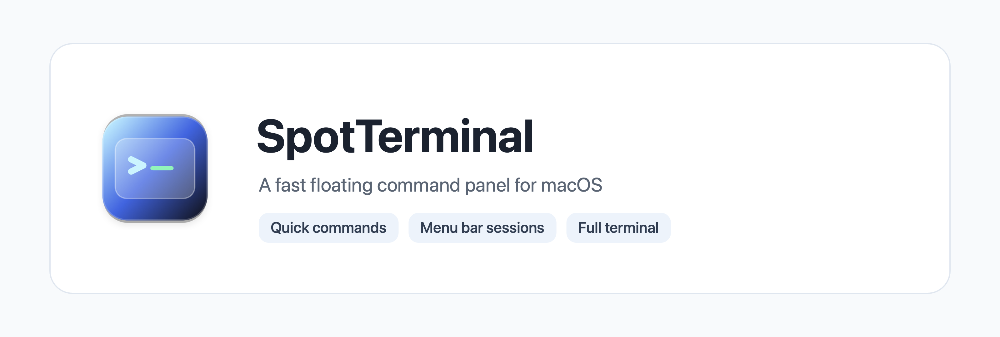
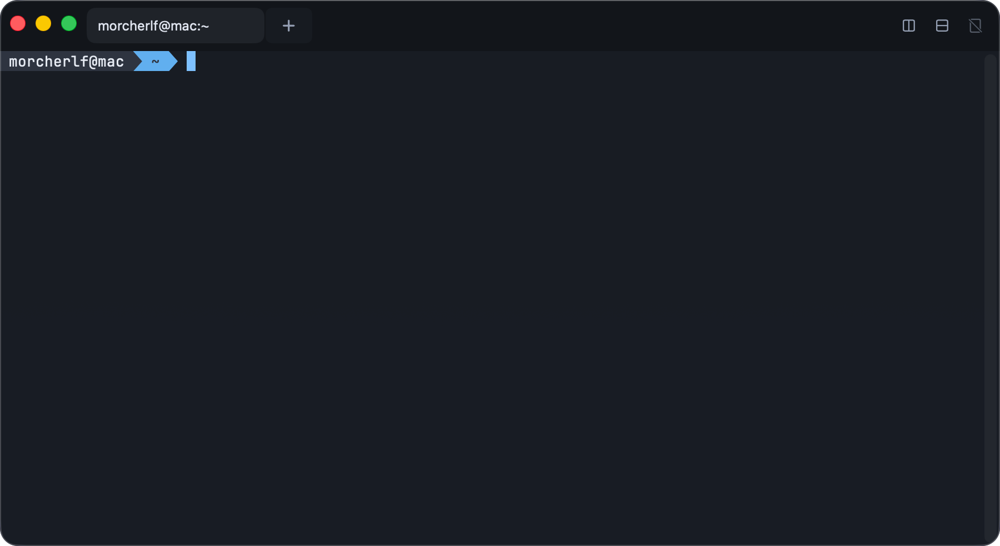
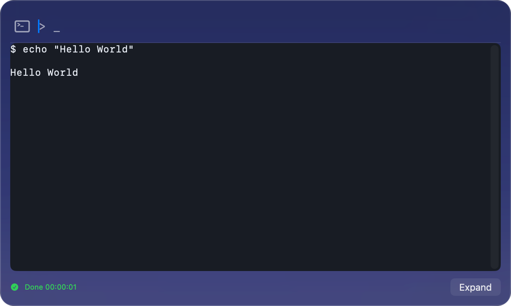
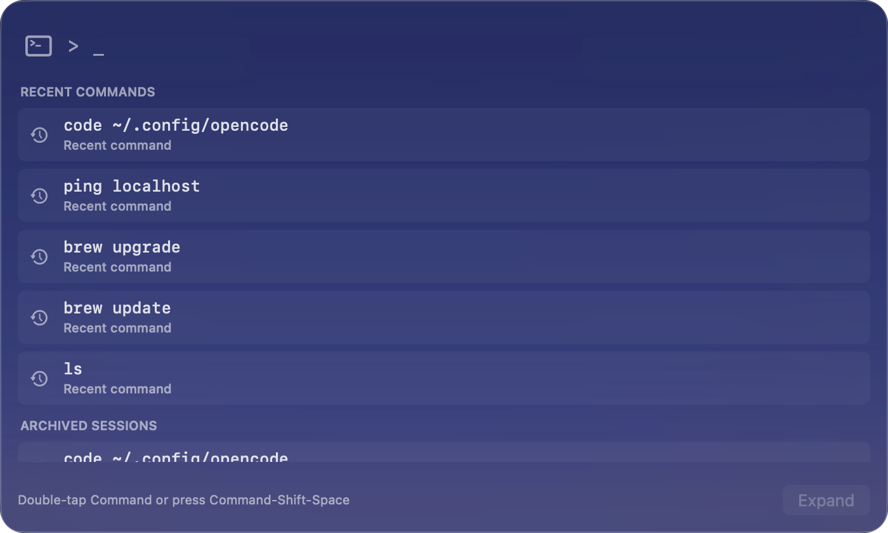
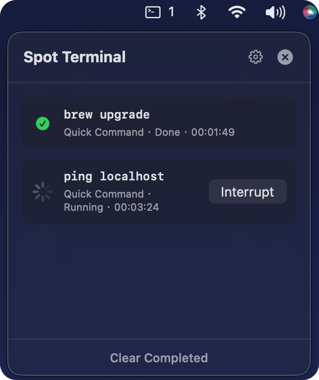

# SpotTerminal

[](https://github.com/MorCherlf/SpotTerminal/actions/workflows/ci.yml)
[](https://github.com/MorCherlf/SpotTerminal/releases)
[](#system-requirements)
[](Package.swift)
[](https://github.com/MorCherlf/SpotTerminal/releases)
[](LICENSE)

SpotTerminal is a native macOS terminal tool featuring a Spotlight-style floating command panel. Summon it anytime with a hotkey to run quick commands, monitor background tasks from the menu bar, and expand into a full terminal when you need more room.

[简体中文](docs/README.zh-Hans.md) | [繁體中文](docs/README.zh-Hant.md) | [日本語](docs/README.ja.md) | [Русский](docs/README.ru.md)



## Highlights

- Floating command panel with command suggestions and Tab completion.
- Full terminal window with tabs, split panes, themes, opacity, and font zoom.
- One-click expand from a quick command into an interactive terminal.
- Menu bar task monitor for background commands.

## Screenshots

| Main Window |
| --- |
|  |

| Run a Quick Command | Floating Command Panel |
| --- | --- |
|  |  |

| Running Sessions |
| --- |
|  |

## System Requirements

- macOS 14 Sonoma or later.
- Apple Silicon and Intel Mac supported.

## Installation

1. Download the latest `.dmg` from [GitHub Releases](https://github.com/MorCherlf/SpotTerminal/releases).
2. Open the `.dmg` and drag `SpotTerminal` into `Applications`.
3. Launch SpotTerminal.

SpotTerminal is currently not notarized by Apple. If macOS shows an "unidentified developer" warning:

1. Open System Settings.
2. Go to Privacy & Security.
3. Find the blocked SpotTerminal message and click Open Anyway.
4. Confirm Open when macOS asks again.

## Build from Source

```bash
swift test
./script/build_and_run.sh --dmg
```

## Security and Privacy

SpotTerminal runs commands locally on your Mac. It does not provide a network server, remote shell API, or external command-control interface.

No telemetry or data collection is included.

## Diagnostics

SpotTerminal can write a local diagnostics log to help with bug reports. The log does not collect personal information or device identifiers.

You can open or clear diagnostics from Settings → Diagnostics.

## Dependencies and Licenses

SpotTerminal is licensed under the Apache License 2.0. See [LICENSE](LICENSE).

Third-party components and license notes are listed in [THIRD_PARTY_NOTICES.md](THIRD_PARTY_NOTICES.md).

## AI-Assisted Development

This project is developed with substantial AI assistance. If you find a bug, security issue, or unexpected behavior, please open an issue.

## Feedback

Please report bugs through [GitHub Issues](https://github.com/MorCherlf/SpotTerminal/issues).
